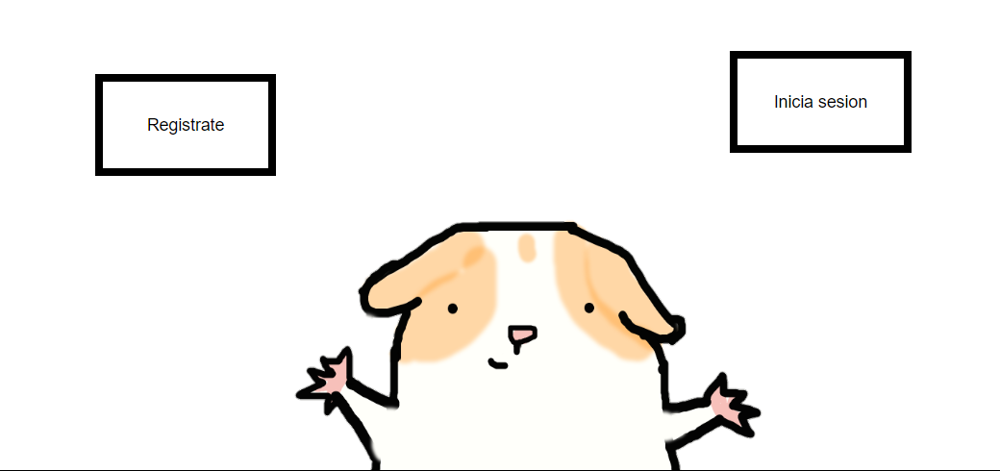

# Cuymmunity-flask
My final project from [CS50's Introduction to Computer Science](https://www.edx.org/es/course/introduction-computer-science-harvardx-cs50x)
---


### A quick view 👀
 
 
 
### Pre-requirements 📝
- Python 3.x


### Instalation 🔧
 - project in your machine
    - ```git clone https://github.com/U-4D89/cuyApp_flask.git```
 - dependencies
    - ```pip install -r requirements.txt```


### Built it with 🔨
- [Flask](https://flask.palletsprojects.com/en/2.0.x/)


### How to run? 🚗🌫
 ```flask run```
