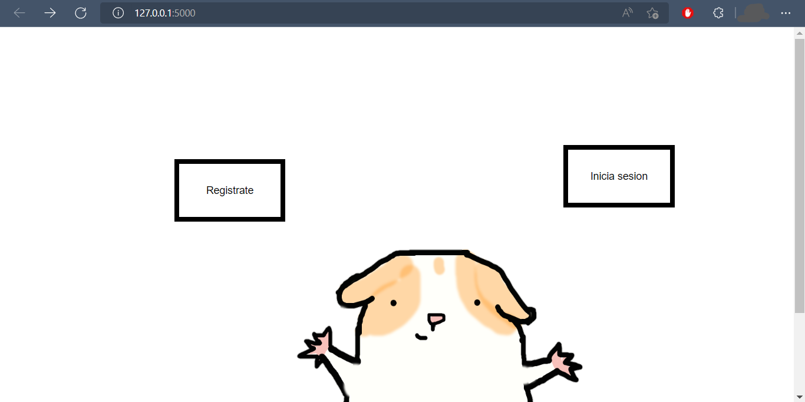

# Cuy-flask
My final project from [CS50's Introduction to Computer Science](https://www.edx.org/es/course/introduction-computer-science-harvardx-cs50x)
---

### A quick view
 {align=center}

### Pre-requirements 📝
- Python 3.x

### Instalation 🔧
 :: Install the project in your machine:
    ```git clone https://github.com/U-4D89/cuyApp_flask.git```
 :: dependencies
    ```pip install -r requirements.txt```

### Built it with 🔨
- [Flask](https://flask.palletsprojects.com/en/2.0.x/)

### How to run? 🚗🌫
 ```flask run```
